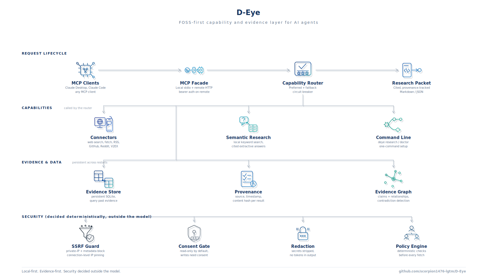

<p align="center">
  
</p>

<p align="center">
  <b>A FOSS-first, local-first capability and evidence layer that gives Claude and any MCP client safe, cited access to the web, with security decided outside the model.</b>
</p>

<div align="center">


</div>

D-Eye is a local tool that gives Claude and other AI assistants a safe, well-sourced way to use the web. It runs on your own machine, is fully keyless and needs no paid third-party service, and turns web research into cited, verifiable results instead of a black box: every answer carries its sources, and the rules about what may be fetched are enforced outside the model, so a web page can never talk your assistant into doing something it shouldn't. The keyless FOSS core works today, and the project is actively growing with more on the roadmap.

---

## What D-Eye is

D-Eye is not a hosted service and not a paid API. It is a local MCP server paired with a command-line (CLI) tool, packaged as a Claude plugin, and it runs on your own machine. Here "tool" means a local piece of software you run, not an MCP tool.

Fundamentally, D-Eye is an MCP server paired with a CLI tool; that is the primary categorization. It exposes a fixed set of MCP tools (search, fetch, extract, export_research_packet, query_evidence, capability_list, connector_health, surface_status, semantic_search, repo_inspect) over stdio, with an optional remote HTTP transport using bearer authentication. It also ships as a Claude plugin with commands and skills, and it includes connectors for web search, RSS, GitHub, Reddit, and other platforms; those connectors are internal components rather than the defining feature. The essence of D-Eye is the MCP server and CLI combined.

In taxonomy, D-Eye is an MCP server first, a CLI second, delivered as a plugin, and the other terms are components inside it:

- MCP server (the primary interface): it speaks the Model Context Protocol, so any MCP client (Claude Desktop, Claude Code, or others) can call its fixed set of tools (search, fetch, extract, export_research_packet, query_evidence, capability_list, connector_health, surface_status, semantic_search, repo_inspect) over stdio, with an optional remote HTTP transport behind bearer authentication.
- CLI (deye): the same capabilities from a terminal.
- Plugin: how D-Eye is packaged for Claude users. The plugin/d-eye bundle registers the server and adds slash-commands, skills, and a doctor hook; the hook and the skills are components that ship with the D-Eye plugin.
- Connectors (web search, fetch, RSS, GitHub, Reddit, V2EX, Bilibili, public YouTube): internal modules that the capability router calls. A connector is a part of the solution, not the defining feature.

## Contents

- [What D-Eye is](#what-d-eye-is)
- [Why D-Eye](#why-d-eye)
- [Capabilities](#capabilities)
- [Prerequisites and installation](#prerequisites-and-installation)
- [Quick start](#quick-start)
- [Register with a client](#register-with-a-client)
- [CLI reference](#cli-reference)
- [Architecture](#architecture)
- [MCP tools reference](#mcp-tools-reference)
- [Configuration and environment](#configuration-and-environment)
- [Use cases](#use-cases)
- [Security posture](#security-posture)
- [Status](#status)
- [Roadmap](#roadmap)
- [Troubleshooting and FAQ](#troubleshooting-and-faq)
- [Repository layout](#repository-layout)
- [Contributing](#contributing)
- [Security policy](#security-policy)
- [License](#license)

## Why D-Eye

Most agent stacks reach the web in ways that are unsafe, unverifiable, or locked behind paid keys. D-Eye fixes that at the layer between the model and the network, with deterministic policy that the model never gets to override.

| Problem | D-Eye's answer |
|---|---|
| Agents fetch unsafely and can be pointed at internal addresses or cloud metadata. | Every fetch passes an SSRF gate that blocks private, loopback, link local, and cloud metadata addresses, then pins the TCP connection to the vetted IP so a hostname cannot rebind to a private target between check and connect. |
| Answers are uncited and cannot be audited. | Every result is captured with its source URL, a retrieval timestamp, and a content hash, and research is returned as a cited packet, not a black box. |
| Fetched text tries to steer the model ("ignore previous instructions"). | Retrieved content is labelled untrusted evidence, never instructions, and security decisions run deterministically outside the model. |
| Many sources need a paid API key or a hosted account. | D-Eye is fully keyless and uses only the Python standard library, so no paid API, hosted account, or third-party service is ever required. Even its semantic, embedding-based search is D-Eye's own local FOSS implementation, not an external provider. |

## Capabilities

| Capability | What you get | Needs setup? |
|---|---|---|
| Keyless web search | Search the public web through the DuckDuckGo HTML endpoint, no key or account. | No |
| Webpage fetch and extraction | Policy gated fetch through the hardened path, plus readable text extraction. | No |
| RSS and Atom | Feed reader hardened against XXE and entity expansion. | No |
| GitHub | Read only public repository metadata and recent commits. | No |
| Reddit, V2EX, and similar community connectors | Keyless reads routed through the same SSRF hardened fetch path. | No |
| Semantic research with cited answers | Local SQLite FTS5 index with grounded extractive answers and a cited research packet. | No |
| Evidence store | Persistent SQLite store with provenance envelopes and per tenant scoping. | No |
| MCP server | Ten stable tools over a local stdio server, or a remote streamable HTTP server. | Local: no. Remote: set a bearer token. |
| Local browser adapter | Optional, opt in, isolated per session context with consent gated actions. | Optional extra |

## Prerequisites and installation

- **Python 3.10 or newer.** The core install pulls zero runtime dependencies (standard library only). If your system `python3` is older (some macs ship 3.9), use a newer interpreter explicitly.
- **Operating system:** macOS and Linux are the tested targets. Broader operating-system coverage is on the roadmap.
- **git** to clone the repository.

Install the core:

```bash
git clone https://github.com/scorpion1476-lgtm/D-Eye D-Eye
cd D-Eye
python3 -m venv .venv
./.venv/bin/python -m pip install -e .
./.venv/bin/deye --version        # deye 0.2.0
```

### Optional extras

Everything the core does is keyless and standard-library only. Extras are opt in and installed with `pip install -e '.[name]'` (quote the brackets in zsh).

| Extra | Install | What it adds | When to use it |
|---|---|---|---|
| `mcp` | `pip install -e '.[mcp]'` | The local stdio MCP server SDK (`mcp[cli]`, pinned `<2`). | To register D-Eye with Claude Desktop or Claude Code. |
| `remote` | `pip install -e '.[remote]'` | The remote Streamable-HTTP MCP transport (`mcp[cli]`, `uvicorn`, `starlette`). | To run `deye serve-http` behind bearer auth. |
| `browser` | `pip install -e '.[browser]'` | The opt-in local browser adapter (`playwright`). Also run `./.venv/bin/python -m playwright install chromium`. | For the optional consent-gated headless browser. |
| `secrets` | `pip install -e '.[secrets]'` | OS keyring support (`keyring`). | To resolve `keychain:` secret references instead of `env:`. |
| `rich` | `pip install -e '.[rich]'` | `feedparser` and `requests`. | Optional richer feed parsing and an alternative HTTP client; the stdlib core already handles feeds and fetch, so this is not required. |
| `dev` | `pip install -e '.[dev]'` | `pytest`, `ruff`, `pip-audit`, `pyyaml`. | To run the test suite and the security and lint checks. |

There is no `embeddings` extra: keyless semantic search runs on a local hashing embedding in the standard-library core, so nothing extra is needed for `deye semantic`.

## Quick start

```bash
# 1. install the core (FOSS, no keys, no accounts)
git clone https://github.com/scorpion1476-lgtm/D-Eye D-Eye
cd D-Eye
python3 -m venv .venv
./.venv/bin/python -m pip install -e .

# 2. one time setup (writes ~/.deye/config.json with FOSS defaults, no secrets)
./.venv/bin/deye setup
./.venv/bin/deye doctor          # confirm connectors are healthy

# 3. run some research (search, fetch, cite, persist)
./.venv/bin/deye research "continuous pricing airline revenue management" \
    --max-sources 5 -o packet.md

# 4. query what was captured
./.venv/bin/deye evidence "continuous pricing"
```

The `research` command searches, fetches the top sources through the SSRF guarded path, extracts readable text, records each source with its URL, timestamp, and content hash into `~/.deye/evidence.db`, and writes a cited Markdown packet plus a JSON companion. Full walkthrough: [`docs/QUICKSTART.md`](docs/QUICKSTART.md).

## Register with a client

D-Eye registers as a local stdio MCP server. Install the `mcp` extra first:

```bash
./.venv/bin/python -m pip install -e '.[mcp]'
```

**Claude Desktop and Claude Code, automatically.** `deye init-claude` merges a `deye` entry into the Claude Desktop config for your OS (backing up any existing file and never dropping other servers) and prints the equivalent Claude Code command:

```bash
./.venv/bin/deye init-claude --dry-run                 # preview, change nothing
./.venv/bin/deye init-claude --python ./.venv/bin/python   # write the config
./.venv/bin/deye init-claude --run-claude-code         # also run `claude mcp add`
```

**Claude Desktop, manually.** Add this to `claude_desktop_config.json` (on macOS at `~/Library/Application Support/Claude/claude_desktop_config.json`), replacing the path with your venv's Python:

```json
{
  "mcpServers": {
    "deye": {
      "command": "/absolute/path/to/D-Eye/.venv/bin/python",
      "args": ["-m", "deye.mcp_server"]
    }
  }
}
```

Restart Claude Desktop so it reloads MCP servers.

**Claude Code, manually.** The exact command `init-claude` prints:

```bash
claude mcp add --scope user deye -- /absolute/path/to/D-Eye/.venv/bin/python -m deye.mcp_server
```

**Any generic MCP client.** Launch the server over stdio with `python -m deye.mcp_server` using the venv Python; the client discovers the ten tools through the standard `tools/list` handshake.

## CLI reference

Every subcommand prints JSON to stdout and reads no secrets on its own. Generated from `deye --help`; run `deye <command> --help` for the exact flags.

| Command | What it does | Example |
|---|---|---|
| `setup` | One-time local setup (read only, no secrets); writes `config.json` under `DEYE_HOME`. | `deye setup` |
| `status` | Show configuration (version, home, read-only, search provider). | `deye status` |
| `capabilities` | List the capability names the router can serve. | `deye capabilities` |
| `connectors` | List registered connectors with license, cost, and credential needs. | `deye connectors` |
| `doctor` | Health-check connectors; `--surfaces` also reports Claude surface activation. | `deye doctor --surfaces` |
| `init-claude` | Register with Claude Desktop / Claude Code. Flags: `--python`, `--dry-run`, `--run-claude-code`. | `deye init-claude --dry-run` |
| `search` | Keyless public web search. | `deye search "sqlite fts5"` |
| `fetch` | Policy-gated fetch and readable-text extract of one URL. | `deye fetch https://example.com` |
| `research` | search then fetch then cited packet, persisting evidence. Flags: `--max-sources`, `--output/-o`. | `deye research "topic" --max-sources 5 -o packet.md` |
| `evidence` | Full-text query over the persistent evidence store. | `deye evidence "pricing"` |
| `semantic` | Keyless semantic search over stored evidence, cited answer. Flag: `--k`. | `deye semantic "pricing" --k 3` |
| `usage` | Report per-adapter usage, estimated cost, and call rate (opt-in log). | `deye usage` |
| `repo` | Inspect a public GitHub repository, read only. | `deye repo owner/name` |
| `bilibili` | Fetch a Bilibili video's public info via the keyless view API. | `deye bilibili <BV-id-or-url>` |
| `transcript` | Fetch a YouTube video's public captions. Flag: `--lang`. | `deye transcript <youtube-url> --lang en` |
| `multi-search` | Fan a query across several public connectors and dedupe. Flag: `--capabilities`. | `deye multi-search "topic"` |
| `graph` | Build an evidence graph plus contradiction candidates. Flags: `--markdown`, `--output/-o`. | `deye graph --markdown -o graph.md` |
| `serve-http` | Run the remote Streamable-HTTP MCP (needs `remote` extra and `DEYE_HTTP_TOKEN`). Flags: `--host`, `--port`. | `DEYE_HTTP_TOKEN=... deye serve-http` |
| `backend` | Local provider-neutral backend: `auth`, `queue`, `object`, `secret`. | `deye backend queue --help` |
| `release` | Sign or verify a release bundle (Ed25519 + SHA256SUMS): `manifest`, `keygen`, `sign`, `verify`. | `deye release verify <bundle-dir>` |
| `lifecycle` | Setup, update, backup, rollback, uninstall, repair. | `deye lifecycle env` |

## Architecture

<p align="center">
  
</p>

D-Eye is organised in four layers:

1. **Request lifecycle.** An MCP client (Claude Desktop, Claude Code, or any MCP client) or the CLI issues a capability request. A capability router picks a healthy, policy compliant connector, falls back on failure, and opens a circuit breaker on a repeatedly failing backend. The result comes back as a cited, provenance tracked research packet in Markdown or JSON.
2. **Capabilities.** Keyless connectors (web search, fetch, RSS, GitHub, Reddit, V2EX and more), a semantic research layer with local keyword search and grounded extractive answers, and the `deye` command line.
3. **Evidence and data.** A persistent SQLite evidence store, provenance for every result (source, timestamp, content hash), and an evidence graph that surfaces claims, relationships, and contradiction candidates.
4. **Security foundation.** Decided deterministically, outside the model: an SSRF guard with private IP and cloud metadata blocking and connection level IP pinning, a consent gate that keeps writes off by default, credential redaction, and a policy engine that runs before every fetch.

## MCP tools reference

The server exposes a small, fixed tool surface. Raw scrapers and shell access are deliberately not exposed to the model. Every tool returns a JSON object.

| Tool | Input | Purpose and output |
|---|---|---|
| `capability_list` | none | Lists the server's capabilities and tool names. Returns `{capabilities: [...], tools: [...]}`. |
| `connector_health` | none | Reports the health of every registered connector, one `{connector, capability, license, status, detail}` per entry. |
| `search` | `query: str` | Keyless public web search; returns a redacted `content` text block of result titles and URLs plus structured `artifacts`. |
| `fetch` | `url: str` | Policy-gated fetch and extract of one URL; returns the readable text plus provenance (url, timestamp, content hash). |
| `extract` | `html: str` | Converts a block of HTML to readable text; returns `{ "text": "..." }`. |
| `export_research_packet` | `query: str`, `max_sources: int = 3` | Search, fetch, cite, persist, and return a grounded Markdown packet with per-source citations. |
| `query_evidence` | `query: str` | Full-text query over the persistent evidence store; returns `{query, results, stats}` with matching records and provenance. |
| `semantic_search` | `query: str`, `k: int = 5` | Keyless semantic search over stored evidence; returns `{query, hits, answer, corpus_size}`, the answer grounded in the k nearest cited sources. |
| `repo_inspect` | `repo: str` | Read-only public GitHub repository metadata and recent commits (owner/name or URL). |
| `surface_status` | none | Reports which client surfaces D-Eye can be active in. |

Example (the `search` tool, as the CLI calls the same handler):

```bash
./.venv/bin/deye search "sqlite fts5"
# -> {"content": "SQLite FTS5 Extension -- https://sqlite.org/fts5.html\n...", "artifacts": [...]}
```

Local stdio and remote streamable HTTP transports are documented in [`docs/MCP_GUIDE.md`](docs/MCP_GUIDE.md). The remote transport requires a bearer token (`DEYE_HTTP_TOKEN`, at least 16 characters) and should sit behind a TLS terminating reverse proxy.

## Configuration and environment

D-Eye reads no secrets on its own and stores none inline. Configuration lives in a single JSON file; secrets are only ever *references* (`env:NAME` or `keychain:SERVICE/ACCOUNT`) resolved at call time and never persisted or logged.

**Config file:** `$DEYE_HOME/config.json` (default `~/.deye/config.json`), created by `deye setup`. The home directory is created owner-only (mode 0700). Shape:

```json
{
  "search_provider": "duckduckgo",
  "read_only": true
}
```

The persistent evidence store is `$DEYE_HOME/evidence.db`.

**Environment variables (all optional):**

| Variable | Effect |
|---|---|
| `DEYE_HOME` | Where D-Eye stores config and evidence. Default `~/.deye`, created mode 0700. |
| `DEYE_OFFLINE` | Set to `1`, `true`, or `yes` for offline mode: local reads only, no network egress; lifecycle update and provisioning refuse to reach the network. |
| `DEYE_HTTP_TOKEN` | Bearer token required by `deye serve-http` (at least 16 characters). Unset means the remote server refuses to start. |
| `DEYE_USAGE_LOG` | Path to an opt-in usage log; when set, adapter usage and estimated cost are recorded for `deye usage`. |
| `DEYE_BROWSER_PROFILES` | Root directory for the optional browser adapter's isolated per-session profiles. |
| `DEYE_BACKEND_PASSWORD` | Password (at least 8 characters) for the local `deye backend auth` user store. |

**Read-only by default and the consent gate.** `read_only` is `true` by default. Write, browser, and side-effecting actions are refused unless a human grants explicit consent for that specific action; the policy engine (`deye/core/policy.py`) decides this outside the model.

## Use cases

Functional and technical workflows, each with a command you can run from the clone root.

- **Produce a cited research packet for a report.** `deye research "continuous pricing airline revenue management" --max-sources 5 -o packet.md` searches, fetches the top sources through the SSRF-guarded path, and writes a cited Markdown packet plus a JSON companion, each source hashed and stored. Outcome: a sourced brief you can hand to a reviewer.
- **Give Claude Desktop safe, cited web access.** Register the local MCP server (see above); the client sees the ten-tool surface, and every response comes back as untrusted evidence with provenance. Outcome: the assistant can research the web without being able to reach internal addresses or obey injected instructions.
- **Query previously gathered evidence, offline.** `DEYE_OFFLINE=1 deye evidence "sqlite fts5"` runs full-text search over the local corpus with zero network egress. Outcome: fast recall of what you already captured, on a plane or an air-gapped box.
- **Answer a question from stored evidence, with citations.** `deye semantic "pricing strategy" --k 3` runs keyless semantic search over the evidence store and returns a grounded answer citing the nearest sources. Outcome: a short, sourced answer without any external call.
- **Read a public GitHub repository.** `deye repo owner/name` returns read-only repository metadata and recent commits, no key required. Outcome: a quick, keyless look at a project's shape.
- **Fan a query across several sources and dedupe.** `deye multi-search "topic"` routes the query across public connectors and merges deduplicated results. Outcome: broader coverage than a single source in one call.
- **Surface contradictions across sources.** `deye graph --markdown -o graph.md` builds an evidence graph over the stored corpus and flags claims that contradict each other. Outcome: a reviewable map of where sources disagree.
- **Use D-Eye inside an agent loop.** Point any MCP client at `python -m deye.mcp_server`; the agent calls `search`, `fetch`, `export_research_packet`, and `query_evidence` as tools, and every result carries provenance. Outcome: web use that stays auditable and policy-bound.

## Security posture

Each control below is genuinely implemented in the tracked source and covered by a test.

| Control | What it does |
|---|---|
| SSRF and policy guard | Scheme allowlist, URL userinfo rejection, and a post resolution IP check that blocks private, loopback, link local, multicast, reserved, and cloud metadata addresses. Fails closed if a host resolves to any non public address. |
| Connection level IP pinning | The socket connects to the vetted IP while TLS still validates against the real hostname (SNI), closing the DNS rebinding time of check to time of use gap. |
| Read only by default, consent gate for writes | Write, browser, and side effecting actions are refused unless a human grants explicit consent for that specific action. |
| No hard coded tokens | Enforced by a test that scans the tracked tree for credential shaped strings. |
| Secret redaction | Every audit line, log entry, and exported packet passes through a credential redactor before it is written or emitted. |
| Untrusted evidence | Every fetched result is tagged untrusted and carries its source, timestamp, and content hash; the model is told never to obey text found inside evidence. |
| Decompression and size caps | Responses are size capped (5 MiB) and decompression aborts past the cap, defending against gzip bombs. |
| Deterministic policy | All of the above is decided outside the model, in `deye/core/policy.py` and the connector fetch path, not by the LLM. |

More detail: [`docs/THREAT_MODEL.md`](docs/THREAT_MODEL.md).

## Status

D-Eye's keyless FOSS core is working and audited: the CLI and the local MCP server run, the security controls are implemented and covered by tests, and the full suite passes on a fresh public clone.

- **Verified in this environment on 2026-08-02:** the full test suite runs with 0 failures on a fresh public clone via `scripts/clean_clone_gate.sh` (with the documented extras and the optional browser extra installed).
- **Static analysis:** Bandit reports 0 high and 0 medium findings.
- **Still growing:** the project is under active development, with more on the [Roadmap](#roadmap). D-Eye as a whole is not claimed to be production ready, and no claim of 100 percent completion is made.

## Roadmap

Forward directions, in general terms:

- A hosted remote MCP endpoint. The local stdio and remote HTTP transports already ship.
- Broader operating-system coverage.
- More connectors as platforms allow.

## Troubleshooting and FAQ

- **`deye doctor` shows a connector as unusable.** Live connectors need network; when a source is unreachable or rate-limited it reports as unusable and the router falls back to a healthy connector. Re-run `deye doctor` (or `deye doctor --surfaces`) once connectivity returns.
- **Working offline.** Set `DEYE_OFFLINE=1` to keep every command to local reads with zero network egress; `deye evidence` and `deye semantic` run fully offline over the stored corpus. Commands that must reach the network (for example `deye research`) degrade cleanly rather than hanging.
- **The browser adapter does nothing.** It is opt in. Install `.[browser]` and run `./.venv/bin/python -m playwright install chromium`; without those, the browser tests skip and the adapter reports itself unavailable rather than failing.
- **Test count varies between runs.** Live-network tests skip when a source is unreachable or rate-limited, so the passing count dips by one or two depending on the network. Structural browser tests skip when Playwright is installed (the live ones run instead), and the reverse offline.
- **`deye serve-http` refuses to start.** It needs the `remote` extra and a `DEYE_HTTP_TOKEN` of at least 16 characters; it fails closed by design. Put it behind a TLS terminating reverse proxy.
- **`init-claude` and my existing MCP servers.** `deye init-claude` merges its entry and backs up the existing config first; it never drops other servers. Use `--dry-run` to preview.
- **Which Python.** D-Eye needs Python 3.10 or newer; if your default `python3` is older, create the venv with a newer interpreter.

## Repository layout

```
D-Eye/             (the clone root is the package root)
  deye/            core package: core (policy, router, evidence, provenance, redact),
                   connectors, research, skills, backend, browser, lifecycle
  tests/           test suite (unit, integration, live network, subprocess, browser)
  docs/            guides (quickstart, MCP, connectors, skills, offline, threat model)
  plugin/d-eye/    Claude plugin: manifest, marketplace, skills, commands, hooks
  assets/brand/    the approved logo and the architecture diagram
  scripts/         build, SBOM, secret scan, dash scan, repo verification
  docker/          remote MCP compose scaffold
  pyproject.toml   packaging; the core has zero runtime dependencies
```

## Contributing

1. **Set up the dev environment.** Create a virtualenv and install the `dev` extra (pytest, ruff, pip-audit, pyyaml):

   ```bash
   python3 -m venv .venv
   ./.venv/bin/python -m pip install -e '.[dev]'
   ```

2. **Run the tests.**

   ```bash
   ./.venv/bin/python -m pytest -q -rs
   ```

   The `mcp`, `remote`, and `browser` extras enable the MCP, remote, and headless-browser tests; without them those tests skip cleanly.

3. **Run the checks.** Lint with ruff and scan for forbidden long dashes:

   ```bash
   ./.venv/bin/ruff check deye
   python3 scripts/scan_ui_dashes.py
   ```

4. **Open a change.** New network or parse paths must route through `deye/connectors/base.py` and `deye/core/policy.py` so they inherit the SSRF gate, IP pinning, size cap, decompression guard, and redirect re-validation. Start from [`docs/DEVELOPER_GUIDE.md`](docs/DEVELOPER_GUIDE.md), and scaffold a new connector with the `connector_builder` skill.

## Security policy

Report vulnerabilities per [`SECURITY.md`](SECURITY.md). Please do not open a public issue for an undisclosed vulnerability.

## License

MIT. See [`LICENSE`](LICENSE). Attribution for third party projects that informed the design, and every runtime and tooling dependency license, lives in [`THIRD_PARTY_NOTICES.md`](THIRD_PARTY_NOTICES.md).
